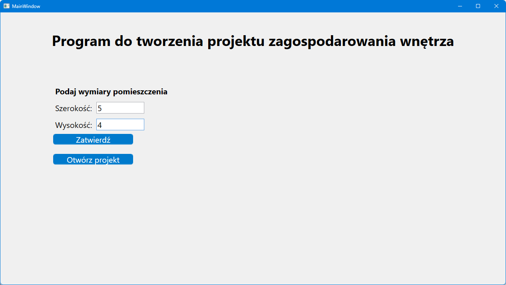
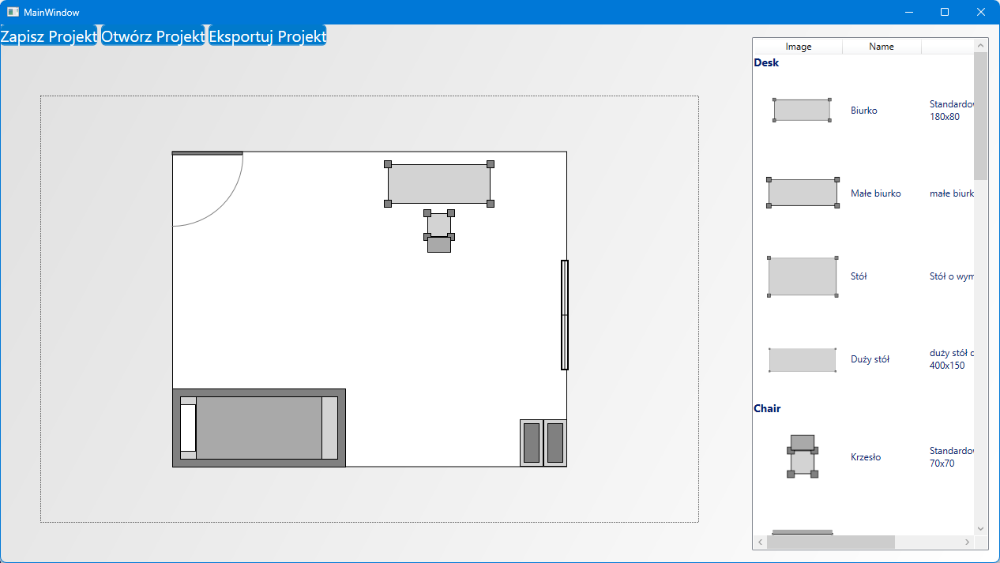

# ArchitectureCreator

ArchitectureCreator to aplikacja WPF (Windows Presentation Foundation) umożliwiająca tworzenie i edytowanie projektów architektonicznych w formie wizualnej. Użytkownik może dodawać, przesuwać, obracać i usuwać elementy na płótnie, a także zapisywać i otwierać projekty w formacie JSON oraz eksportować je jako obrazy PNG.

## Funkcjonalności

- Tworzenie projektów z możliwością ustawienia rozmiarów pokoju.
- Dodawanie elementów na płótnie (Canvas) poprzez wybór elementu z listy i kliknięcie w wybrane miejsce.
- Przesuwanie i obracanie elementów na płótnie.
- Usuwanie elementów poprzez naciśnięcie klawisza `Delete`.
- Zapisywanie projektów do pliku `JSON`.
- Otwieranie zapisanych projektów i renderowanie ich na płótnie.
- Eksportowanie projektów do pliku graficznego `PNG`.

## Użycie

1. Przy uruchomieniu aplikacji wybierz rozmiar pokoju lub załaduj istniejący projekt.
2. Wybierz element z listy i kliknij na płótnie, aby dodać element.
3. Przytrzymaj lewy przycisk myszy, aby przesunąć element, lub użyj kółka myszy, aby go obrócić.
4. Aby usunąć element, zaznacz go i naciśnij `Delete`.
5. Użyj przycisków w menu, aby zapisać, otworzyć lub wyeksportować projekt.

## Przykłady

### Tworzenie nowego projektu
1. Wybierz rozmiar pokoju (np. szerokość: 5m, wysokość: 4m).
2. Dodaj elementy, przeciągając je na płótno.

### Zapisywanie projektu
1. Kliknij przycisk "Zapisz projekt".
2. Plik `canvasProject.json` zostanie utworzony w katalogu aplikacji.

### Otwieranie projektu
1. Kliknij przycisk "Otwórz projekt".
2. Aplikacja wczyta dane z pliku `canvasProject.json`.

### Eksportowanie projektu
1. Kliknij przycisk "Eksportuj projekt".
2. Plik `canvas.png` zostanie zapisany w katalogu aplikacji.

## Screenshots

